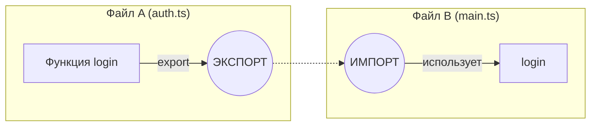
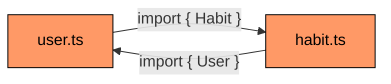
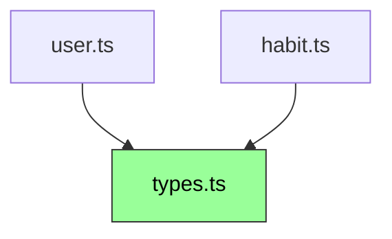

# 📦 Модули в JavaScript и TypeScript: Руководство

Это руководство объясняет, как работают модули, импорты и экспорты.

---

## 1. Что такое модули?

**Модуль** — это изолированный фрагмент кода в отдельном файле. Все, что объявлено внутри модуля (переменные, функции, классы), по умолчанию является **приватным** и недоступно для других файлов.

Чтобы сделать часть кода доступной извне, ее нужно **экспортировать** (`export`). Чтобы использовать код из другого модуля, его нужно **импортировать** (`import`).

### Схема взаимодействия


---

## 2. Экспорт (Export)

Существует два основных вида экспорта: **Именованный** и **По умолчанию**.

### 2.1. Именованный экспорт (Named Export)
Позволяет экспортировать несколько сущностей из одного файла.

```typescript
// utils.ts
export const PI = 3.14;

export function add(a: number, b: number) {
    return a + b;
}

export class Calculator {}
```

### 2.2. Экспорт по умолчанию (Default Export)
В файле может быть только **один** экспорт по умолчанию. Обычно используется для основного предназначения модуля.

```typescript
// Logger.ts
export default class Logger {
    log(msg: string) {
        console.log(msg);
    }
}
```

---

## 3. Импорт (Import)

Способ импорта зависит от того, как был сделан экспорт.

### 3.1. Импорт именованных сущностей
Используются фигурные скобки `{}`. Имена должны совпадать.

```typescript
import { PI, add } from './utils';

console.log(add(PI, 2));
```

### 3.2. Импорт экспорта по умолчанию
Фигурные скобки **не нужны**. Имя при импорте может быть любым.

```typescript
import MyLogger from './Logger'; // Назвали MyLogger вместо Logger

const logger = new MyLogger();
```

### 3.3. Импорт всего как объекта
Если нужно импортировать много именованных сущностей сразу.

```typescript
import * as MathUtils from './utils';

console.log(MathUtils.PI);
console.log(MathUtils.add(1, 2));
```

### 3.4. Переименование при импорте (Aliasing)
Помогает избежать конфликтов имен.

```typescript
import { add as performAddition } from './utils';

performAddition(5, 5);
```

---

## 4. Сравнение типов экспорта

| Особенность | Именованный экспорт | Экспорт по умолчанию |
| :--- | :--- | :--- |
| **Количество** | Сколько угодно | Только один |
| **Скобки `{}`** | Обязательны | Запрещены |
| **Имя при импорте** | Должно совпадать | Любое имя |

---

## 5. Реэкспорт (Re-export / Barrel files)

Часто используется в папках (например, `src/types/index.ts`), чтобы собрать все экспорты в одно место для удобного импорта.

```typescript
// src/types/user.ts
export interface User { id: number; name: string; }

// src/types/habit.ts
export interface Habit { id: number; title: string; }

// src/types/index.ts (Агрегатор)
export * from './user';
export * from './habit';
```

Теперь в других файлах можно писать коротко:
```typescript
import { User, Habit } from './types'; // TypeScript сам найдет index.ts
```

---

## 6. Циклические зависимости (Circular Dependencies) ⚠️

Это ситуация, когда Файл А импортирует Файл Б, а Файл Б импортирует Файл А. Это создает замкнутый круг.

### Схема проблемы


### Пример кода (Проблема)
Представьте, что у пользователя есть список привычек, а у привычки есть автор.

```typescript
// user.ts
import { Habit } from './habit';

export interface User {
    id: number;
    name: string;
    habits: Habit[]; // Нужен тип Habit
}

// habit.ts
import { User } from './user';

export interface Habit {
    id: number;
    title: string;
    author: User; // Нужен тип User
}
```
В этом примере файлы ссылаются друг на друга. Если это будут не просто интерфейсы, а классы или константы, один из модулей при запуске может получить `undefined`, так как другой модуль еще не успел полностью инициализироваться.

### Как исправить?
Лучший способ — вынести общие типы в отдельный файл (**types.ts**), от которого будут зависеть оба модуля, либо использовать `import type` (в TypeScript).



**Решение с выделением типов:**
```typescript
// types.ts
export interface User { id: number; name: string; }
export interface Habit { id: number; title: string; }

// user.ts
import { User, Habit } from './types';
// ... логика работы с пользователем

// habit.ts
import { User, Habit } from './types';
// ... логика работы с привычками
```

**Почему это плохо?** 
Это приводит к непредсказуемому поведению: ошибки выполнения (Runtime errors), сложности при тестировании и проблемы с "недогруженными" экспортами. Сборщики вроде Vite часто выдают предупреждение, если находят такие связи.

---

## 7. TypeScript особенности

В TS можно импортировать/экспортировать только типы. Это помогает сборщикам (Vite, Webpack) полностью удалять этот код при сборке в JS.

```typescript
import type { User } from './types'; // Только для системы типов
```

---

### Итог:
1. Используйте **именованный экспорт**, если в файле много полезных функций/констант.
2. Используйте **экспорт по умолчанию**, если файл представляет собой один класс или одну главную функцию.
3. Создавайте `index.ts` файлы в папках с типами или компонентами для чистоты импортов.
